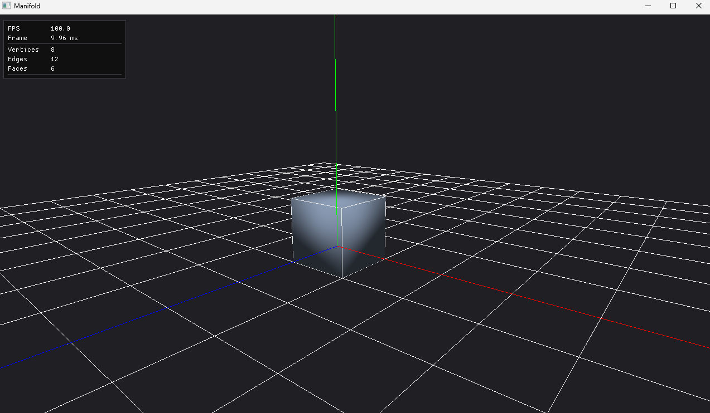

# Manifold
a mini blender if you will..

## Features

**Half-edge data structure** representation for efficient traversal from any vertex, edge, or face to their neighbors:

- We define our half-edges, each face has its own 4 half-edges, totaling 24 half-edges (4 × 6)
- We move along the vertices of each face, set that vertex to be the half-edge's vertex, set the next half-edge to be the next half-edge and the prev to be the previous
- Next we stitch those faces together by identifying each half-edge's twin. To do so, we build a map that maps each half-edge index to a unique number based on its "from" and "to" vertex
- We then walk across the entire mesh's half-edges, and if a half-edge doesn't have a twin, we get its vertex and its next's vertex, use that to hash into our function to return the index of its twin, and we set that as its twin
-     7---------- 6     Y
-  4  :        5 :      |__ X
-  |  :        | :     /
-  |  3 -------|- 2   Z
-  | /         |/
-  0 --------- 1 

## TBD

- Face/Edge/Vertex Selection
- Face Extrusion
- Face Subdivide

