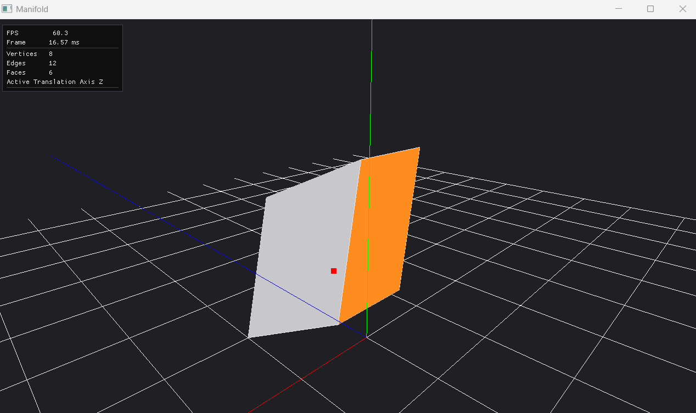

# Manifold
a mini blender if you will..

## Features

1. **Half-edge data structure** representation for efficient traversal from any vertex, edge, or face to their neighbors:

- We define our half-edges, each face has its own 4 half-edges, totaling 24 half-edges (4 × 6)
- We move along the vertices of each face, set that vertex to be the half-edge's vertex, set the next half-edge to be the next half-edge and the prev to be the previous
- Next we stitch those faces together by identifying each half-edge's twin. To do so, we build a map that maps each half-edge index to a unique number based on its "from" and "to" vertex
- We then walk across the entire mesh's half-edges, and if a half-edge doesn't have a twin, we get its vertex and its next's vertex, use that to hash into our function to return the index of its twin, and we set that as its twin
```text
     7----------6     Y
  4  :        5 :      |__ X
  |  :        | :     /
  |  3 -------|- 2   Z
  | /         |/
  0 --------- 1
```

2. Face Selection & Translation

- Face selection is a raycast to nearest hit face, it would be nice to have an X-ray mode to allow selection of all intersecting faces not just the nearest.
- Selected faces remain selected until user manually unselects them by clicking on a selected face, it would be better to use a ctrl-click mechanism for multi-select, and default selection, deselects older selection otherwise (like in Blender).
- Faces can be selected by clicking on them, then for all selected faces translation can be done by specifying a translation axis X,Y,Z (using keyboard letters x,y,z) and using KEY_UP/KEY_DOWN. Translation axis is a fixed state that remains set until changed, and can only do one axis at a time, so we have a limited DOF. 
- For every update we have to reupload the whole mesh, and I wonder if there's a way to do this more efficiently?

3. Wireframe rendering
- Would be good to have a toggle to enable just wireframe or just faces, currently we always have both, would also be useful to have a vertex rendering with gl_points. we currently use gl_points to debug the position of the last mouse hit anyway.
## TBD
- Edge/ Vertex Selection
- Face Extrusion
- Face Subdivide



