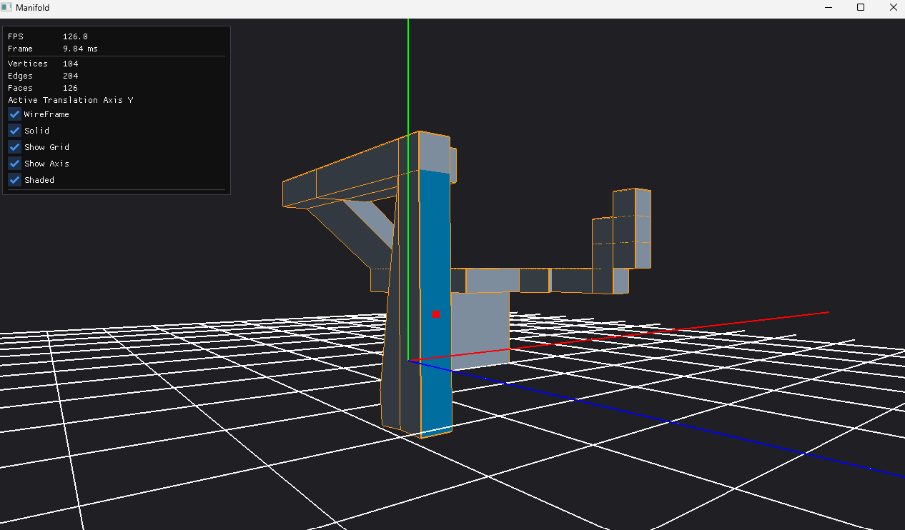

# Manifold
a mini blender if you will..

## Features

1. **Half-edge data structure** representation for efficient traversal from any vertex, edge, or face to their neighbors:

- We define our half-edges, each face has its own 4 half-edges, totaling 24 half-edges (4 × 6)
- We move along the vertices of each face, set that vertex to be the half-edge's vertex, set the next half-edge to be the next half-edge and the prev to be the previous
- Next we stitch those faces together by identifying each half-edge's twin. To do so, we build a map that maps each half-edge index to a unique number based on its "from" and "to" vertex
- We then walk across the entire mesh's half-edges, and if a half-edge doesn't have a twin, we get its vertex and its next's vertex, use that to hash into our function to return the index of its twin, and we set that as its twin
```text
     7----------6     Y
  4  :        5 :      |__ X
  |  :        | :     /
  |  3 -------|- 2   Z
  | /         |/
  0 --------- 1
```

2. Face Selection & Translation

- Face selection is a raycast to nearest hit face, it would be nice to have an X-ray mode to allow selection of all intersecting faces not just the nearest.
- Selected faces remain selected until user manually unselects them by clicking on a selected face, it would be better to use a ctrl-click mechanism for multi-select, and default selection, deselects older selection otherwise (like in Blender).
- Faces can be selected by clicking on them, then for all selected faces translation can be done by specifying a translation axis X,Y,Z (using keyboard letters x,y,z) and using KEY_UP/KEY_DOWN. Translation axis is a fixed state that remains set until changed, and can only do one axis at a time, so we have a limited DOF. 
- For every update we have to reupload the whole mesh, and I wonder if there's a way to do this more efficiently?

3. Wireframe rendering
- Would be good to have a toggle to enable just wireframe or just faces, currently we always have both, would also be useful to have a vertex rendering with gl_points. we currently use gl_points to debug the position of the last mouse hit anyway.

3. Face Extrusion
- After selecting a face, press L to extrude.
- This was probably the trickiest thing to implement so far, and I am still not certain it will always work as intended. The key idea is that for extrusion we need to do the following:
- 1. Grab a selected face, copy its vertices and pushing them a little along the face's normal. (would be a good idea to make that value specified by user, but they can always translate later so that will do)
- Since these vertices have the same winding of the old face, their normals correctly face outwards so we can immediatly use them to build the new face. (that is construct 4 new half edges and link them together)
- the trick is that we need to grab the half edges of the face (before extrusion) and reuse them as half edges of the new side faces that will connect the mesh with the new face.
to make it make sense lets assume we are extruding upwards, which means we need 4 vertical edges (one up and one down for each) and a cap (the new face) (and 4 horizontal edges the cap sits on)

- 2. now we can create the top 4 half edges (on which the cap will sit) for each half edge of the top, the twin comes from the cap
- 3. create the 4 side edges that connect old face with new face, for each edge we create two half edges one UP one Down, and appropriately set the vertices
- 4. finally add the 4 side faces, 
we already have the half edges for them, the trick is to identify the right half edges.
these half edges are the old half edge (from old face),
the half edge extending from it (up), 
the (top) half edge,
and finally the half edge returning from it (down)

4. Flat Shading
- Flat shading simply requires having seperate vertices for each triangle so that each vertex normal can depend on its own triangle's normal. Before we used to share vertices and determine the normal by averaging neighboring faces normals. For simplicity we keep the vertices buffer without duplication, and we duplicate just before we create the Vertex Buffer Object. We do that through emitTriangle(). It would be good to support a toggle between that and smooth shading later.


## TBD
- Edge/ Vertex Selection
- Face Subdivide
- 




